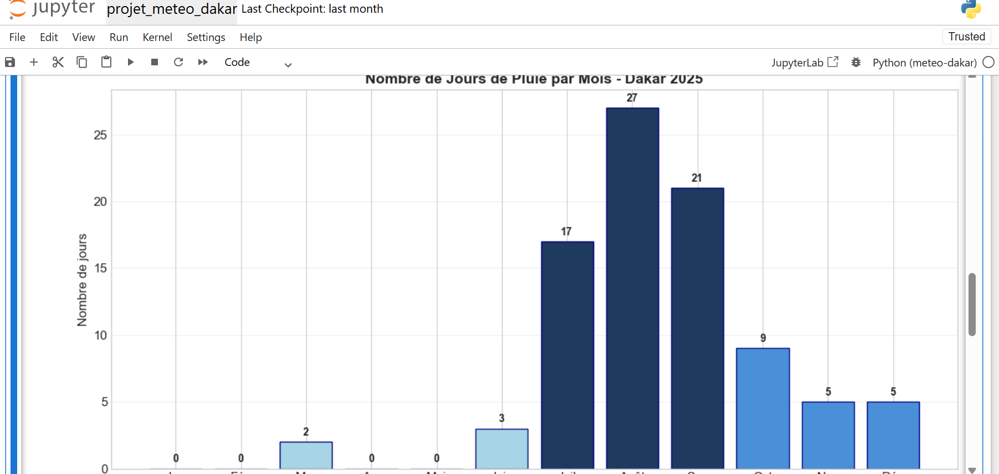
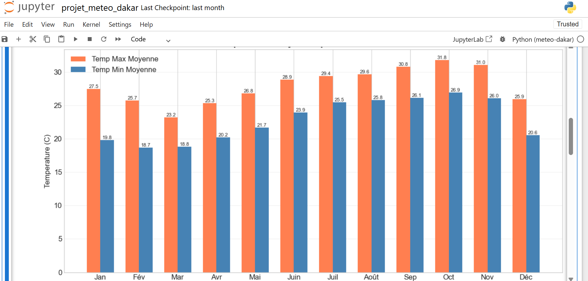
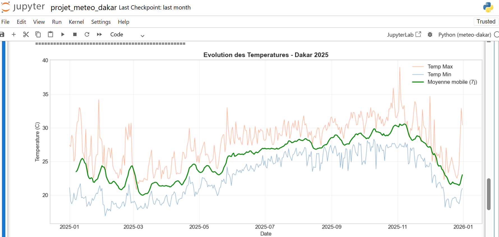

# Dakar Weather Data Analysis 🌍🌦️

## Overview

This project analyzes weather data for **Dakar, Senegal** using Python and PostgreSQL.

The objective is to build a simple **data pipeline** that stores weather data in a database, processes it using Python, and generates visual insights through data visualization.

This project demonstrates how **data engineering, data analysis, and visualization** can be combined in a real workflow.

---

## Features

• Store weather data in a **PostgreSQL database**  
• Retrieve and process data using **Python**  
• Analyze weather patterns using **Pandas**  
• Visualize climate trends using **Matplotlib**

---

## Technologies Used

- Python
- PostgreSQL
- Pandas
- Matplotlib
- Psycopg2
- Jupyter Notebook

---

## Project Structure

projet_meteo_dakar
│
├── projet_meteo_dakar.ipynb # Data analysis notebook
├── images # Project visualizations
│ ├── rainy_days.png
│ ├── monthly_temperatures.png
│ └── temperature_evolution.png
│
└── README.md

---

# Data Visualizations 📊

## Monthly Rainy Days in Dakar (2025)

This chart shows the number of rainy days recorded each month in Dakar during 2025.  
The rainy season is clearly concentrated between **July and September**, with **August being the wettest month**.

---

## Average Monthly Temperatures

This visualization compares **average monthly maximum and minimum temperatures** in Dakar.  
It highlights the relatively stable tropical climate throughout the year.

---

## Daily Temperature Evolution

This chart shows **daily maximum and minimum temperatures during 2025**, along with a **7-day moving average** to better visualize the overall trend.

---

## Installation

Clone the repository

git clone https://github.com/Fadall/projet_meteo_dakar.git

Navigate into the project folder

cd projet_meteo_dakar

Install dependencies

pip install pandas matplotlib psycopg2

---

## Database Configuration

Update the database connection settings in the notebook.

Example configuration:

DB_CONFIG = {
"host": "your_host",
"port": "5432",
"database": "your_database",
"user": "your_user",
"password": "your_password",
"sslmode": "require"
}

---

## Future Improvements

• Automate weather data collection using a weather API  
• Build an interactive dashboard (Streamlit or Dash)  
• Apply machine learning models for weather prediction  
• Deploy the analysis pipeline in the cloud

---

## Author

**Mohamed El Fadilou KEBE**
